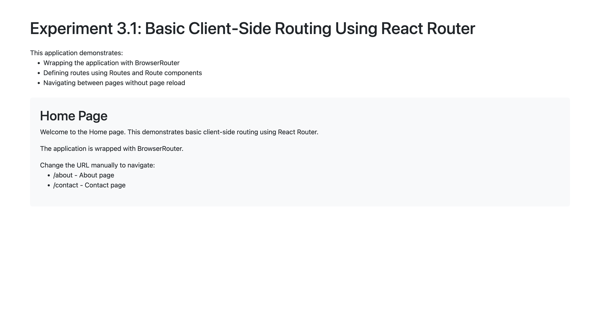
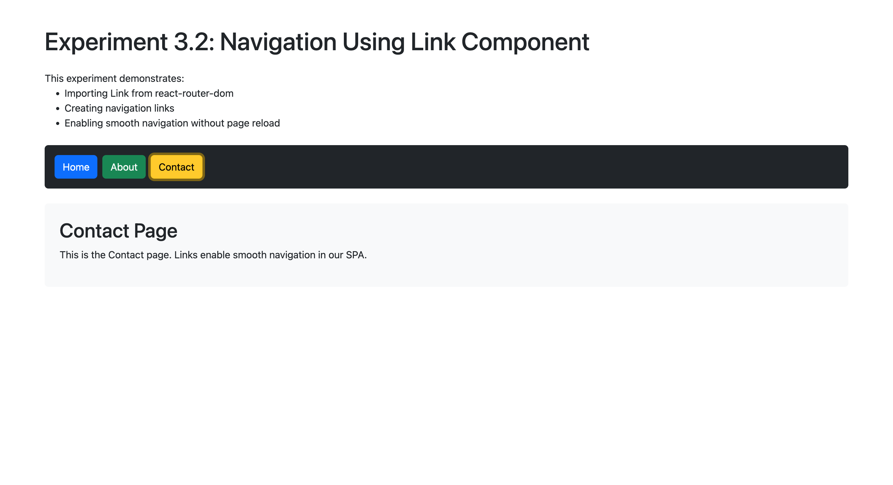
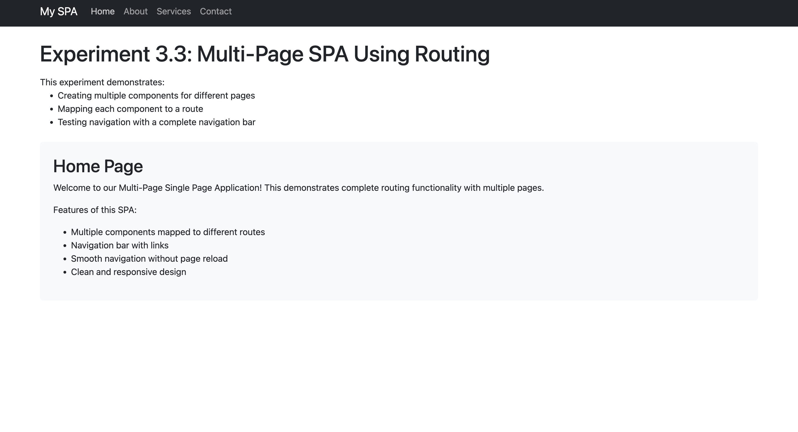

# Experiment 3: Implementing Routing in Single Page Applications (SPA)

## Overview

Unit-3 experiments demonstrating client-side routing implementation using React Router in Single Page Applications.

## Experiments

### 3.1 - Create Multiple Components

Building multiple React components for routing demonstration

### 3.2 - Map Components to Routes

Implementing route mapping for different components

### 3.3 - Test Navigation

Complete navigation testing with React Router Link component

