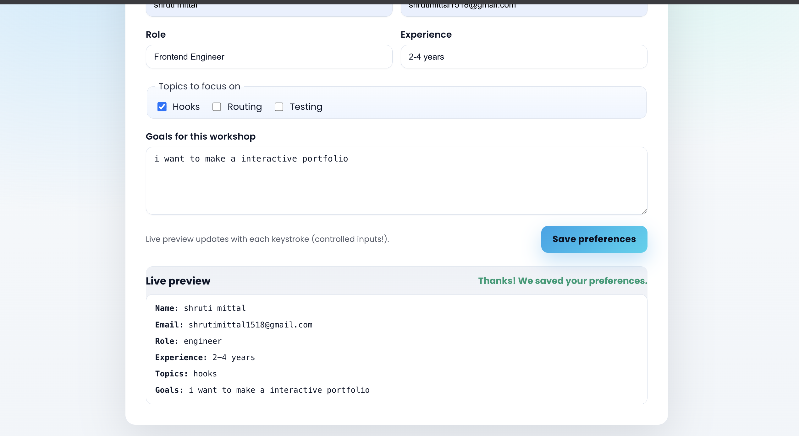

# Experiment 6.1 – Controlled Components Form (Vite + React)

## Overview

A fully controlled React intake form demonstrating state-driven inputs, live preview, interactive focus/hover states, and a progress indicator. The UI is centered with Poppins typography, light gradients, and ambient glows for a modern, professional feel.

## Screenshots

Below are live captures stored in `src/screenshots/`:




> If you capture new shots, place them in `src/screenshots/` and update the paths above as needed.

## Tech Stack

- React 18
- Vite
- Poppins via Google Fonts

## Key Implementation Notes

- All inputs (text, email, select, checkboxes, textarea) are controlled via React `useState`.
- Live preview mirrors component state immediately, showing controlled input behavior.
- Focus/hover states use inline styles for quick inspection of interactive cues.
- Progress pill calculates completion from required fields (`fullName`, `email`, `role`).
- Ambient gradient glows and soft borders create a unique yet lightweight UI.

## How to Run

1. Install dependencies (from this folder):
   ```bash
   npm install
   ```
2. Start the dev server:
   ```bash
   npm run dev -- --host --port 5173
   ```
3. Open http://localhost:5173 in your browser.

## What to Explore

- Toggle checkboxes and watch the preview update instantly.
- Focus fields to see animated shadows and border transitions.
- Submit to see the transient confirmation message.
- Fill required fields and observe the progress pill change.

## Folder Structure (6.1)

- `src/App.jsx` – Form UI, state handling, progress indicator, live preview.
- `src/App.css` – Global font import, root centering, base colors.
- `public/` – Vite public assets.

## Experiment Alignment

- Controlled components: form values live in component state and update on every `onChange`.
- Event handling covers text, select, checkbox, and textarea inputs.
- Submit handler simulates async save for demonstration.

## Next Steps (optional)

- Add real validation and inline error states.
- Persist submissions to an API or localStorage.
- Add success/failure toasts for richer UX.

## Repo Integration

To add this experiment into your Git repo:

```bash
cd "/Users/shrutimittal1518gmail.com/Downloads/college/Full-Stack-Lab-main/Exp - 6/6.1"
git add .
git commit -m "Add Experiment 6.1 controlled form with UI enhancements"
git push origin main  # or your target branch
```

If the remote is not set:

```bash
git remote add origin https://github.com/buildsbyshruti/fullstack-lab.git
```

Adjust branch name as needed (e.g., `main` or `master`).
