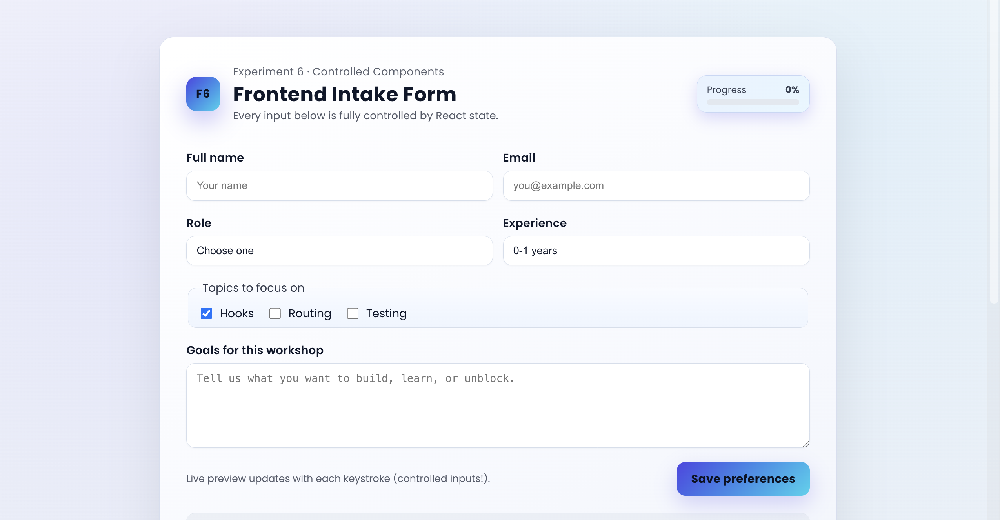
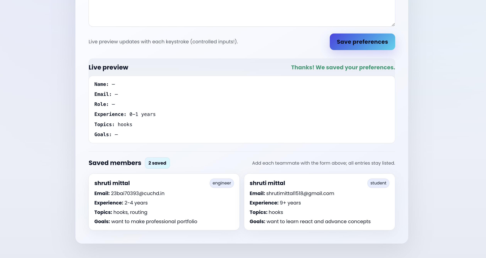
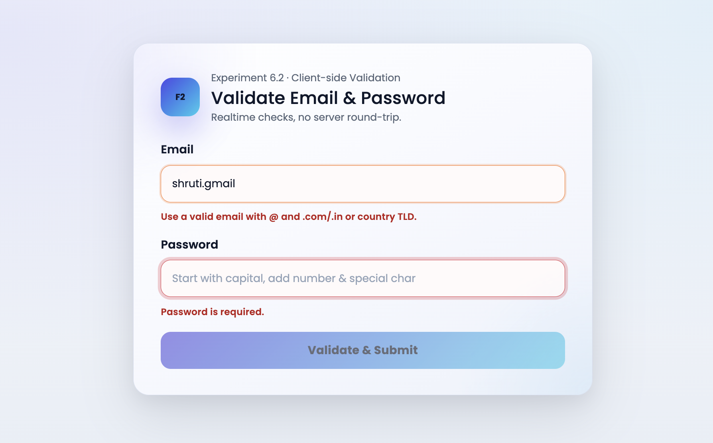
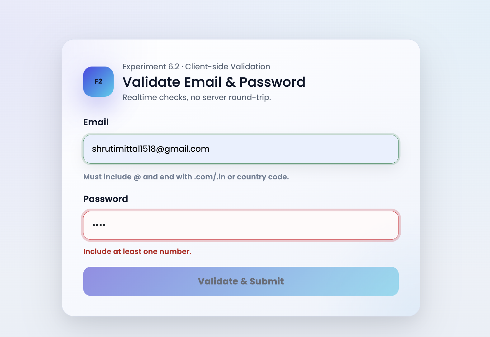
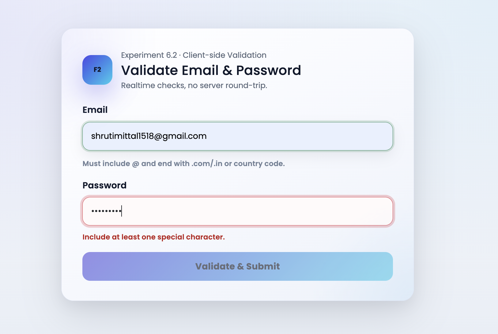
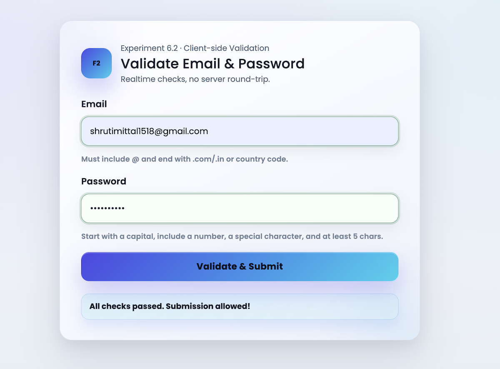

# Experiment 6 – React Forms & Validation

A two-part lab exploring controlled components and client-side validation with modern UI polish.

---

## 6.1 – Controlled Components & Multi-Entry Intake

- Fully controlled form fields (name, email, role, experience, topics, goals).
- Live completion meter and instant preview of the active form.
- Persist multiple member submissions in a saved list (cards).
- Accent styling with Poppins and indigo/teal gradients.

### Run 6.1

```bash
cd "Exp - 6/6.1"
npm install
npm run dev
```

### Screenshots

- 
- 

---

## 6.2 – Client-Side Form Validation (Email + Password)

- Email rules: must contain `@` and end with `.com`, `.in`, or any country TLD.
- Password rules: starts with a capital letter, includes at least one number, one special character, and is 5+ characters long.
- Bootstrap validation visuals (valid/invalid states, feedback messages).
- Clean Poppins-based UI with indigo/teal accents.

### Run 6.2

```bash
cd "Exp - 6/6.2"
npm install
npm run dev
```

### Screenshots

- 
- 
- 
- 

---

## Notes

- Both apps use Vite. If the dev server was already running, restart it after installing dependencies.
- Bootstrap is required for 6.2 (already added via `npm install bootstrap`).
