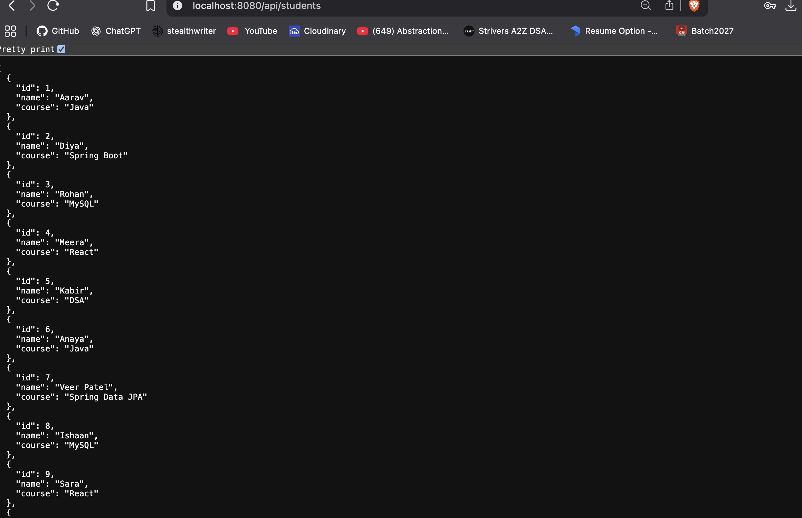
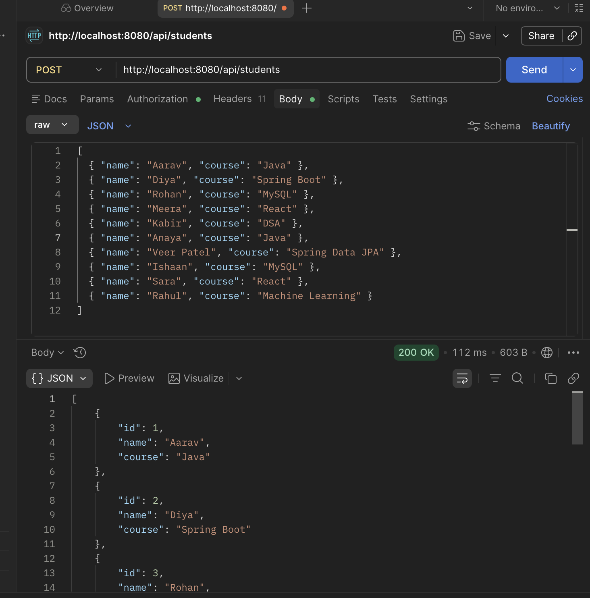
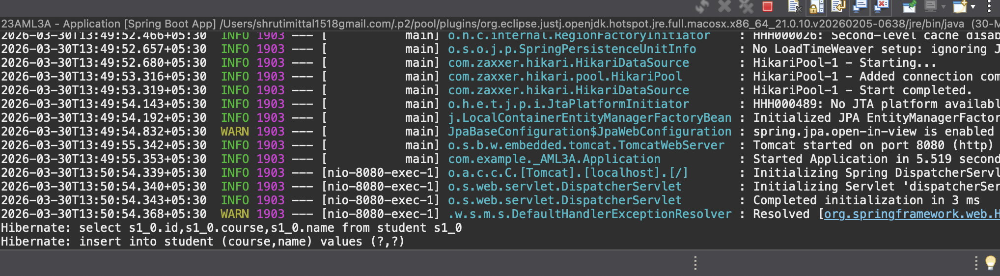
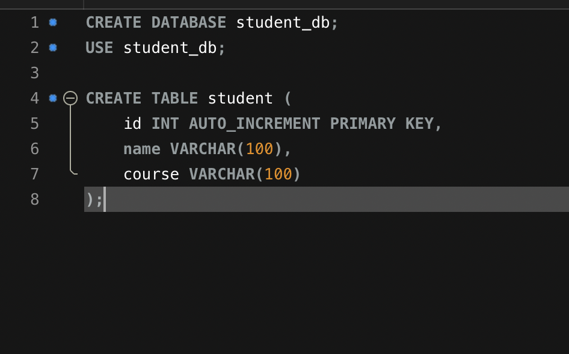
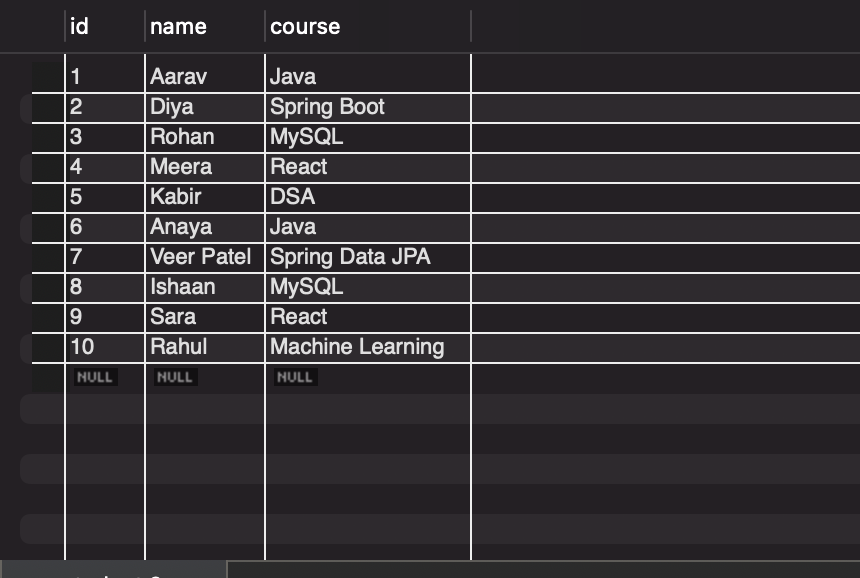

# Experiment 8: Building a RESTful API with Spring Boot

## Objective

To develop a Spring Boot application that provides a RESTful API for managing Student records, including CRUD operations (Create and Read) for individual and bulk records.

## Tech Stack

- **Backend:** Spring Boot (Java 17)
- **Data Persistence:** Spring Data JPA
- **Database:** H2 / MySQL (In-memory/Local)
- **Build Tool:** Maven
- **API Testing:** Postman / Browser

## Features

- Fetch all student records via `GET` request.
- Add a new student record via `POST` request.
- Bulk insert multiple student records via `POST` request.

## API Endpoints

| Method | Endpoint        | Description                  |
| :----- | :-------------- | :--------------------------- |
| `GET`  | `/api/students` | Get all students             |
| `POST` | `/api/student`  | Add a single student         |
| `POST` | `/api/students` | Add multiple students (Bulk) |

### Sample JSON Request (Single Student)

```json
{
  "name": "Shruti Mittal",
  "course": "Computer Science"
}
```

### Sample JSON Request (Bulk Students)

```json
[
  {
    "name": "Alice Johnson",
    "course": "Information Technology"
  },
  {
    "name": "Bob Smith",
    "course": "Artificial Intelligence"
  }
]
```

## Project Structure

```text
src/main/java/com/example/_AML3A
├── Application.java (Main Entry Point)
├── controller
│   └── StudentController.java (REST Controller)
├── model
│   └── Student.java (JPA Entity)
├── repository
│   └── StudentRepository.java (Data Access)
└── service
    └── StudentService.java (Business Logic)
```

## How to Run

1.  Clone the repository.
2.  Import as a Maven project in IntelliJ or VS Code.
3.  Run the `Application.java` file.
4.  Use Postman or a browser to access the endpoints at `http://localhost:8080/api/students`.

## Screenshots

### 1. Application Running & Adding Student



### 2. Postman POST Request (Single)



### 3. GET Request (All Students)



### 4. Database Verification / H2 Console



### 5. Final Output


