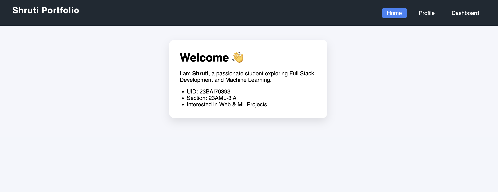
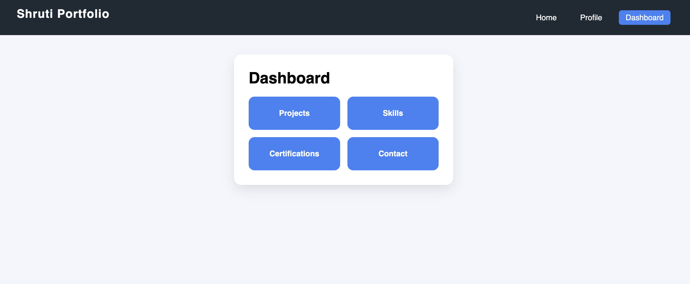
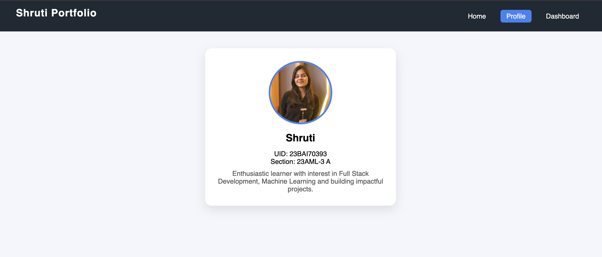

# Full Stack Lab

This repository contains my Full Stack Lab experiments and mini-projects.

## Folder Overview

- `Exp - 1` to `Exp - 6`: React and frontend lab experiments
- `Exp - 8`: Spring Boot REST API experiment
- `EXP9`: JWT authentication experiment
- `portfolio`: Personal portfolio project

## Screenshot Previews

### Portfolio

### Experiment 8 (Spring Boot API)

## Notes

- Individual experiment details and full screenshot sets are available in each experiment's README.
- Local dependency folders like `node_modules` are excluded from version control.
