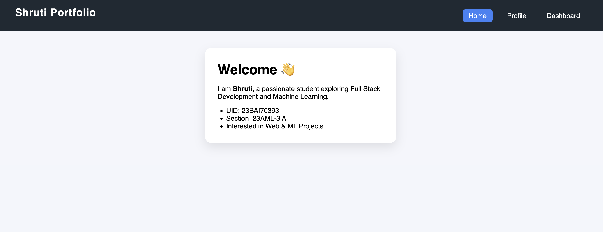
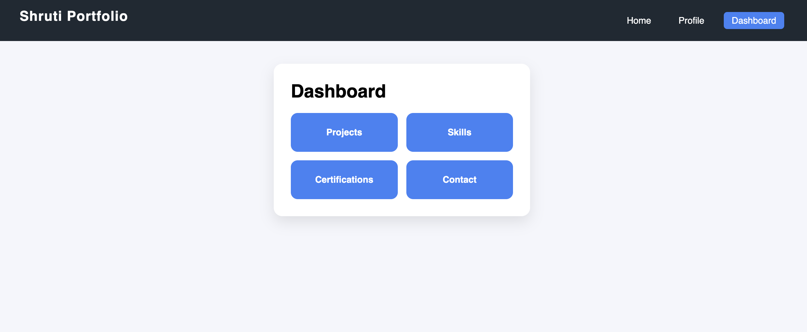
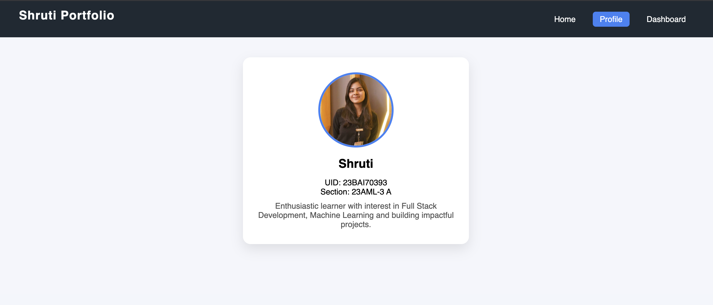

🌐 Shruti's Portfolio Website

A modern personal portfolio web application built using React + Vite and React Router DOM to showcase my profile, skills, projects, and achievements through a clean, multi-page interface.

This project demonstrates core React concepts such as component-based architecture, client-side routing, and reusable UI components.

🚀 Tech Stack

React

Vite

JavaScript (ES6+)

CSS3

React Router DOM

✨ Features

Multi-page navigation using React Router DOM

Home page with personal introduction

Profile page with image and brief bio

Dashboard section displaying:

Projects

Skills

Certifications

Contact

Reusable and responsive navigation bar

Simple and user-friendly interface

## 📸 Screenshots

### Home Page



### Projects Section



### Contact Section



## ▶️ How to Run Locally

```bash
cd portfolio
npm install
npm run dev
```
